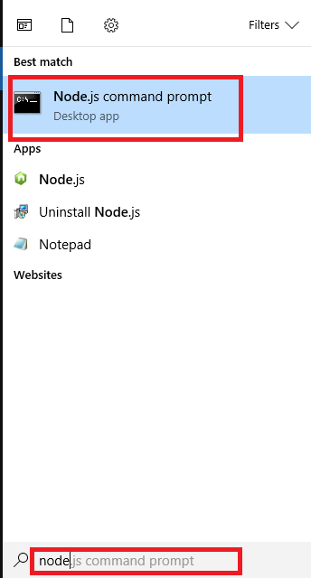
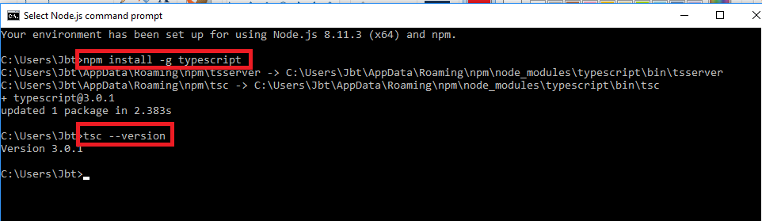
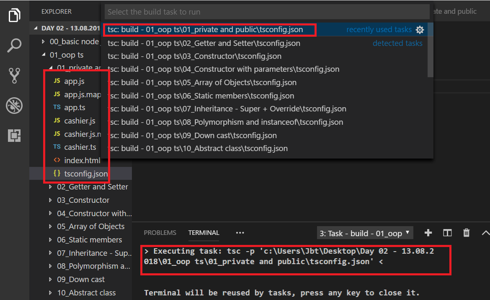

# Steps to run ts file with vs code
## Step 1 - open node command prompt

---
## Step 2 - install tsc global (with npm)

---
## Step 3 - create a new ts file named `index.ts`, with the following content:
```typescript
let num:number=4;
```

## Step 4 - open command prompt
* click *right click* on the `index.ts` file
* choose `open in command prompt`
---
## Step 5 - run command to craete js file
* in the command prompt that we opened in the prev step, write this command:
```bash
tsc index.ts
```
* this command will create a `index.js` file, with this content:
```javascript
var num=4;
```
---
## Step 6 - transpile all ts files with one command:
* add to the app folder a new filenamed `tsconfig.json`, with the following content:
```json
{
    "compilerOptions": {
        "target": "es5",
        "module": "commonjs",
        "sourceMap": true
    }
}
```
* click `control + shift + b` and run:
***



